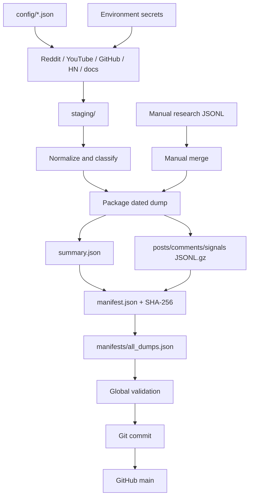

# Publisher Architecture

This repository is the collection and publication half of the [Reddit Product Insights system](https://github.com/subothsundar123/reddit-insights-claude-agent/blob/main/ARCHITECTURE.md).

The linked document is the canonical end-to-end architecture. This document focuses on the publisher’s components, data contracts and extension rules.

## 1. Responsibility

The publisher:

- collects approved public sources;
- normalizes them into consistent records;
- hashes direct usernames;
- classifies segment, topic, feature, persona, intent and competitors;
- packages immutable dated gzip files;
- generates summaries and SHA-256 manifests;
- maintains feature and SEO catalogs;
- commits and publishes snapshots through GitHub.

It does not generate final Claude analysis and does not write to connector users’ machines.

## 2. Internal flow



## 3. Main module and command

`src/insights_publisher/cli.py` contains:

- source adapters;
- shared signal construction;
- topic and feature classification;
- JSONL/gzip packaging;
- manual research merging;
- manifest generation;
- checksum validation;
- publication commands.

Installed command:

```text
insights-publisher
```

## 4. CLI commands

| Command | Behavior |
|---|---|
| `collect` | Collect Reddit through API or public fallback |
| `collect-signals` | Collect GitHub, HN, broker docs and YouTube |
| `collect-youtube` | Collect YouTube text/comments only |
| `package` | Convert staged data into a dated dump |
| `add-manual-research` | Merge normalized public research JSONL |
| `validate` | Verify every published file checksum |
| `publish` | Commit publication files and optionally push |
| `daily` | Run collectors, package, validate and commit |

Important: `daily` creates a local data commit even without `--push`.

## 5. Configuration

```text
config/
├── channels.json
├── public_signal_sources.json
├── retail_feature_keywords.json
├── web_research_queries.json
└── youtube_keywords.json
```

### Reddit

`channels.json` controls:

- approved subreddits;
- `hot`, `new` and `top` listings;
- post/comment limits;
- cross-Reddit searches;
- search time window.

`auto` mode chooses PRAW when `REDDIT_CLIENT_ID` is available and public JSON otherwise.

### YouTube

`youtube_keywords.json` controls:

- retail/API partitions;
- query buckets;
- SEO seeds;
- video/comment limits;
- publication window;
- request pause.

`retail_feature_keywords.json` supplies:

- five pinned Nubra brand searches;
- feature-specific rotating queries;
- persona aliases;
- feature bucket metadata.

Round-robin selection prevents one bucket consuming the daily allowance.

### Public signals

`public_signal_sources.json` controls:

- GitHub queries;
- Hacker News queries;
- broker documentation URLs;
- YouTube configuration.

## 6. Shared normalization

Cross-channel adapters call `_signal`, which supplies:

- stable ID;
- hashed author;
- topic tags;
- feature-ID mapping;
- persona mapping;
- intent classification;
- retail/API segment;
- competitor mapping;
- source method and evidence quality.

Manual JSONL passes through `_normalize_signal_row` and receives the same defaults.

## 7. Data contracts

### Reddit post

```json
{
  "id": "t3_example",
  "subreddit": "IndianStockMarket",
  "title": "Example",
  "body": "Public post text",
  "score": 10,
  "num_comments": 4,
  "permalink": "https://reddit.com/...",
  "author_hash": "u_...",
  "collected_on": "YYYY-MM-DD",
  "source_method": "reddit_collector",
  "evidence_quality": "direct_collection"
}
```

### Cross-channel signal

The canonical shape is `schemas/public-signal.schema.json`. New adapters should not invent incompatible top-level formats.

### Manual signal

Use `manual-research/output-template.jsonl`, one JSON object per line.

## 8. Packaging contract

```text
daily-dumps/YYYY-MM-DD/
├── posts.jsonl.gz
├── comments.jsonl.gz
├── signals.jsonl.gz
├── summary.json
└── manifest.json
```

`package_dump`:

1. deduplicates Reddit posts by ID;
2. normalizes posts/comments;
3. loads cross-channel signals;
4. writes deterministic gzip JSONL;
5. writes `summary.json`;
6. computes SHA-256 checksums;
7. writes the dated manifest;
8. updates `manifests/all_dumps.json`.

Gzip uses zero modification time, making identical logical content deterministic.

## 9. Manual enrichment

Trigger phrase:

```text
dump todays social media data
```

Workflow instructions are under `manual-research/`.

```bash
insights-publisher add-manual-research \
  --date YYYY-MM-DD \
  --input staging/manual_research_YYYY-MM-DD.jsonl
```

The merge is ID-based and regenerates summary, manifest and index.

## 10. Integrity

Every dated manifest records:

- repository-relative path;
- byte length;
- SHA-256 digest.

`insights-publisher validate` traverses the global index and verifies every file.

Feature and SEO catalogs have separate manifests. The connector verifies those digests after download.

## 11. Scheduling

GitHub Actions runs daily at 02:00 Asia/Kolkata:

```text
.github/workflows/daily-collection.yml
```

It has repository `contents: write`; secrets are job environment variables.

Windows can install a local publisher task:

```powershell
.\scripts\install_daily_task.ps1
```

The task uses `StartWhenAvailable`.

## 12. Catalog maintenance

### Product

```text
product-catalog/current.json
product-catalog/manifest.json
product-catalog/history/
product-catalog/retail-upcoming-features.json
```

Merge aliases into existing capabilities rather than adding duplicate features.

### SEO

```text
marketing-keywords/current.json
marketing-keywords/manifest.json
```

Generate GitHub-readable views:

```bash
python tools/export_marketing_keywords_markdown.py
```

## 13. Add a source adapter

1. Add source configuration.
2. Implement `collect_<source>_signals`.
3. Respect access rules and rate limits.
4. Call `_signal`.
5. Use a stable external ID and canonical URL.
6. Preserve source-native engagement.
7. Set source method and evidence quality.
8. Add to `collect_public_signals`.
9. Add unit tests.
10. Validate a temporary dump.
11. Confirm connector import before scheduling.

## 14. Required checks

```bash
python -m unittest discover -s tests -v
insights-publisher validate
git diff --check
```

Never push:

- API keys or passwords;
- personal contact information;
- private-community content;
- browser sessions;
- credential-bearing staging files.

## 15. Current constraints

- Reddit public JSON may return 403; credentials are needed for stable direct collection.
- YouTube is quota constrained.
- GitHub search is rate limited.
- Manual research is not a scheduled adapter.
- App stores, LinkedIn, Twitter/X, Telegram and Discord are not fully automated.
- Classification is rule-based.
- Git is a practical current data bus, not a long-term analytical warehouse.
